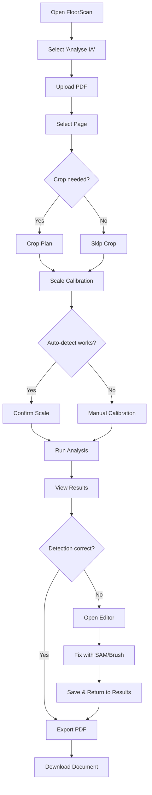
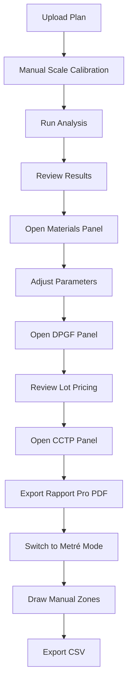

# UX Design Specification — FloorScan

**Author:** Marco
**Date:** 2026-03-16

---

## Executive Summary

### Project Vision

FloorScan transforms static architectural floor plans into structured, actionable data for French BTP professionals. The UX must make complex AI-powered analysis (multi-model detection, mask editing, DPGF/CCTP generation) feel as simple as uploading a photo. The 7-step wizard is the backbone — each step must feel like natural forward progress, not a technical hurdle.

### Target Users

| Persona | Tech-Savvy | Context | Primary Goal |
|---------|-----------|---------|--------------|
| General Contractor (Jean, 45) | Low-Medium | On-site tablet or office desktop | Fast surface areas + opening counts for quotes |
| Quantity Surveyor (Sophie, 32) | Medium | Office desktop, multi-monitor | Precise measurements + DPGF/CCTP for bills |
| Architect (Pierre, 38) | Medium-High | Office desktop, large screen | Plan comparison, visual diff, exports to CAD |
| Admin/Developer (Marco) | High | Desktop | Model configuration, system monitoring |

**Usage context:** Predominantly desktop (1280px+), secondary tablet (768px+). Mobile is not a primary use case but should not break. French-speaking primary audience, with EN/ES/DE/IT as secondary.

### Key Design Challenges

1. **Complexity vs. Simplicity** — 7 steps with 10+ result panels is overwhelming. Must progressively disclose without hiding critical features.
2. **Trust in AI** — Users need to visually verify AI detection quality. Mask overlays must be clear, toggleable, and obviously correct.
3. **Professional credibility** — Exported documents (DPGF, CCTP, Rapport Pro) must look polished enough for client-facing use.
4. **Dual audience** — Non-technical contractors need hand-holding; experienced surveyors need speed and precision.

### Design Opportunities

1. **Guided confidence** — Show detection accuracy indicators, highlight uncertain areas, celebrate successful analysis
2. **Smart defaults** — Auto-detect scale, pre-select common room types, remember user preferences
3. **Professional polish** — Dark theme conveys technical sophistication; exported PDFs elevate the brand
4. **Contextual AI assistant** — Chatbot can reduce UI complexity by answering "how do I?" questions in-context

---

## Core User Experience

### Defining Experience

The defining experience is the **"reveal moment"** — when a user uploads a floor plan and, seconds later, sees it come alive with colored overlays showing every wall, door, window, and room automatically detected and labeled. This is the "wow" moment that justifies the entire product.

### Platform Strategy

| Platform | Strategy | Priority |
|----------|----------|----------|
| Desktop (1280px+) | Full experience — side panels, large canvas, multi-column results | Primary |
| Tablet (768-1023px) | Functional — single-column panels, touch-friendly targets, simplified canvas | Secondary |
| Mobile (<768px) | Graceful degradation — results readable, but editing not supported | Tertiary |

**Input modes:** Mouse + keyboard primary. Touch support for crop and scale calibration. No pen/stylus requirements.

### Effortless Interactions

| Action | Must Feel Like | Current Friction |
|--------|---------------|-----------------|
| Upload PDF | Drag & drop, instant | Good — already implemented |
| Select page | Click thumbnail | Good |
| Crop plan | Natural drag rectangle | Good — zoom/pan works |
| Scale calibration | Click two points, type distance | Medium — auto-detect helps |
| Run analysis | One click, watch progress | Good — needs better progress feedback |
| Toggle overlays | Instant on/off switches | Good — multiple toggles available |
| Edit mask | Paint with brush, natural | Good — SAM click-to-segment helps |
| Export | One click per format | Medium — dropdown could be clearer |

### Critical Success Moments

1. **Analysis complete** — Overlays appear on plan, surfaces calculated, rooms labeled → User thinks "This actually works!"
2. **First mask correction** — SAM click segments perfectly → User thinks "I can fix the AI easily"
3. **DPGF generated** — Lot-by-lot pricing appears → User thinks "This would have taken me hours"
4. **PDF exported** — Professional document downloads → User thinks "I can send this to my client"

### Experience Principles

1. **Progressive revelation** — Show complexity only when the user is ready for it
2. **Visual verification** — Every AI detection is visually verifiable and correctable
3. **Professional output** — Every export must be client-presentation ready
4. **Forgiving workflow** — Any step can be revisited; undo is always available; work is auto-saved

---

## Desired Emotional Response

### Primary Emotional Goals

| Stage | User Should Feel | Design Implication |
|-------|-----------------|-------------------|
| Upload | Confident, in control | Clear file requirements, drag-drop zone, progress indicator |
| Analysis running | Anticipation, trust | Progress bar with stages, not just a spinner |
| Results reveal | Impressed, relieved | Smooth overlay animation, immediate surface summary |
| Editing | Empowered, precise | Responsive brush, undo always visible, instant recalculation |
| Export | Professional, proud | Polished PDF preview, multiple format options |

### Emotional Journey Mapping

```
Upload → Crop → Scale → [wait] → REVEAL → Explore → Edit → Export
  😊      😐      🤔     😬⏳      🤩✨      😎       🎯      💼✅
```

The emotional dip during analysis wait must be minimized by showing **meaningful progress** (not just a spinner), and the reveal must be **dramatic enough** to create a wow moment.

### Micro-Emotions

- **Confidence vs. confusion** → Clear step labels, persistent stepper showing position, back button always available
- **Trust vs. skepticism** → Mask overlays are semi-transparent so users always see the original plan underneath
- **Accomplishment vs. frustration** → Toast notifications confirm successful actions; errors explain what to do next
- **Delight vs. indifference** → Smooth Framer Motion transitions between steps; panel open/close animations

### Emotional Design Principles

- **Primary goal:** User feels like an expert with superpowers
- **Secondary feelings:** Professional confidence, time saved, accuracy trust
- **Emotions to avoid:** Overwhelm (too many panels), doubt (inaccurate detection), abandonment (no help when stuck)

---

## UX Pattern Analysis & Inspiration

### Inspiring Products Analysis

| Product | What Works | Transferable Pattern |
|---------|-----------|---------------------|
| **Figma** | Infinite canvas with layers panel, zoom/pan, selection tools | Layer-based mask editing, zoom controls, canvas interaction |
| **Canva** | Simple 3-step workflow for complex output, drag-drop, templates | Progressive wizard UI, one-click export, template-based reports |
| **Google Maps** | Overlay toggling (satellite, terrain, transit), info panels on click | Mask overlay toggles, room info panels on hover/click |

### Transferable UX Patterns

**Navigation Patterns:**
- Wizard/stepper with completed step indicators (Canva-style)
- Side panel for contextual details (Figma-style)
- Floating action button for global tools (Maps-style)

**Interaction Patterns:**
- Toggle switches for layer visibility (Figma layers panel)
- Click-to-select with info popover (Google Maps POI)
- Brush/eraser with size control (any image editor)

**Visual Patterns:**
- Semi-transparent colored overlays on base image
- Collapsible sidebar panels
- Floating toolbar for edit modes

### Anti-Patterns to Avoid

- **Modal overload** — Don't use modals for every confirmation; use inline confirmations
- **Hidden features** — Don't bury important panels behind multiple clicks; surface via tabs
- **No-feedback actions** — Every click must produce visible feedback within 200ms
- **Jargon without explanation** — "DPGF", "CCTP", "PMR" need contextual tooltips for non-expert users

### Design Inspiration Strategy

| Approach | Pattern | Applied To |
|----------|---------|-----------|
| **Adopt** | Wizard stepper with visual progress | 7-step workflow |
| **Adopt** | Toggle switches for layer visibility | Mask overlay controls |
| **Adapt** | Figma canvas editing tools | Mask editor (simplified for non-designers) |
| **Adapt** | Google Maps info cards | Room detail popover on hover |
| **Avoid** | Complex nested menus | Use flat tab panels for results |

---

## Design System Foundation

### Design System Choice

**Selected:** Tailwind CSS utility-first + Radix UI headless primitives + custom components

**This is a brownfield decision** — the existing codebase already uses Tailwind + Radix. The UX spec formalizes and standardizes usage rather than replacing the system.

### Rationale for Selection

- Tailwind provides rapid iteration with utility classes
- Radix UI ensures accessible primitives (Dialog, Tooltip, Popover, Select)
- Custom components fill gaps (plan canvas, mask editor, 3D viewer)
- No migration cost — existing components already use this stack

### Implementation Approach

Formalize the existing component library in `components/ui/`:
1. **Extend Button variants** — Add `warning` variant (currently missing)
2. **Create Tooltip wrapper** — Standardize tooltip usage (currently `title=` attribute only)
3. **Create Loader component** — Standardize loading indicators (currently inconsistent sizes)
4. **Create EmptyState component** — No pattern currently exists
5. **Create FeedbackMessage component** — Standardize success/error/warning/info inline messages

### Customization Strategy

**Design tokens to formalize:**

| Token Category | Current State | Action Needed |
|---------------|--------------|---------------|
| Colors | Hardcoded hex in components | Extract to `tailwind.config.ts` `extend.colors` |
| Spacing | Tailwind defaults | No change needed |
| Typography | Tailwind defaults + Inter | Document type scale |
| Borders | `rounded-xl` on buttons | Standardize across all interactive elements |
| Shadows | Inconsistent | Define 3 shadow levels: `sm`, `md`, `lg` |

---

## Detailed Core Experience

### User Mental Model

**How users currently solve this problem:**
- Manual measurement with ruler on printed plans → hours of tedious work
- CAD software (AutoCAD) → expensive, requires training
- Basic PDF annotation tools → no calculations, no AI

**Expectations they bring:**
- "Upload and get results" simplicity (like a photo filter app)
- Professional-grade accuracy (this replaces manual measurement)
- French BTP terminology (DPGF, CCTP, PMR — not generic English terms)

**Where confusion likely occurs:**
- Scale calibration (what if they don't know the scale?)
- Connect step (admin-only, but visible in stepper → confusion for regular users)
- Multiple result panels (10+ tabs/panels → which one do I need?)

### Success Criteria

| Criteria | Metric | Current State |
|----------|--------|--------------|
| "This just works" | Analysis completes without error | < 2% failure rate |
| Time to value | Upload to results < 3 minutes | Achieved for standard plans |
| Discoverability | Users find DPGF panel without help | Unknown — needs testing |
| Correction ease | Mask edit + recalculate < 30 seconds | Achieved with SAM |

### Experience Mechanics

**Initiation:**
1. User selects mode (IA Analysis, Metré, Facade, Diff, Cartouche)
2. Upload step: drag-drop zone or file picker
3. PDF: page selection thumbnails → image: direct to crop

**Interaction:**
1. Crop: drag rectangle with handles, zoom/pan
2. Scale: auto-detect with confirmation, or manual 2-point trace
3. Analysis: one-click trigger, progress stages displayed
4. Results: toggle overlays, scroll room list, open panels
5. Editor: select layer, brush/eraser/SAM, undo/redo bar

**Feedback:**
- Step completion: stepper updates with checkmark + green color
- Analysis progress: stage-based progress (uploading → detecting → calculating → done)
- Mask edit: overlay updates in real-time, surface recalculates
- Export: toast notification with success/error + download trigger

**Completion:**
- Export options prominently displayed
- Session auto-saved for future return
- ChatBot suggests next actions ("Would you like to generate a DPGF?")

---

## Visual Design Foundation

### Color System

**Semantic Colors (from existing codebase, formalized):**

| Token | Hex | Usage |
|-------|-----|-------|
| `primary` | `#8B5CF6` (violet-500) | Primary actions, active states, brand accent |
| `secondary` | `#6366F1` (indigo-500) | Secondary actions, links |
| `success` | `#10B981` (emerald-500) | Success toasts, completed steps, positive states |
| `warning` | `#F59E0B` (amber-500) | Warnings, attention required |
| `error` | `#EF4444` (red-500) | Error toasts, destructive actions |
| `info` | `#06B6D4` (cyan-500) | Informational states, hints |

**Overlay Colors (detection masks):**

| Element | Color | Hex |
|---------|-------|-----|
| Walls (AI) | Amber | `#F59E0B` with 40% opacity |
| Doors | Magenta | `#FF00CC` with 50% opacity |
| Windows | Cyan | `#00CCFF` with 50% opacity |
| French Doors | Orange | `#FB923C` with 50% opacity |
| Cloisons | Purple | `#A855F7` with 40% opacity |
| Interior | Green | `#22C55E` with 30% opacity |

**Room Colors (14 types):**
- Defined in `ROOM_COLORS` object — currently duplicated in `results-step.tsx` and `editor-step.tsx`
- **Action:** Extract to shared `lib/room-colors.ts` constant

### Typography System

| Level | Size | Weight | Usage |
|-------|------|--------|-------|
| h1 | `text-3xl` (30px) | Bold | Page titles, hero text |
| h2 | `text-2xl` (24px) | Semibold | Section headers, panel titles |
| h3 | `text-lg` (18px) | Semibold | Sub-section headers |
| body | `text-sm` (14px) | Normal | Default text, descriptions |
| caption | `text-xs` (12px) | Normal | Labels, metadata, secondary info |

**Font:** System font stack via Tailwind defaults (Inter when available)

### Spacing & Layout Foundation

| Token | Value | Usage |
|-------|-------|-------|
| `space-xs` | `4px` (p-1) | Icon padding, tight spacing |
| `space-sm` | `8px` (p-2) | Between related elements |
| `space-md` | `16px` (p-4) | Between sections, card padding |
| `space-lg` | `24px` (p-6) | Between major sections |
| `space-xl` | `32px` (p-8) | Page padding, large gaps |

**Layout grid:** Content max-width 1400px centered. Sidebar panels 320-400px. Canvas fills remaining space.

### Accessibility Considerations

| Requirement | Standard | Current State | Action |
|-------------|----------|--------------|--------|
| Color contrast | WCAG AA (4.5:1) | Mostly compliant (dark bg + light text) | Audit amber/yellow on dark |
| Focus indicators | Visible on all interactive elements | Missing in most components | Add `focus-visible:ring-2` |
| Screen reader | Meaningful labels on all controls | No aria-labels anywhere | Add aria-labels to all buttons/inputs |
| Keyboard nav | All features accessible via keyboard | Not tested | Add tabIndex, keyboard handlers |

---

## Design Direction Decision

### Chosen Direction

**Dark Professional** — The existing dark theme conveys technical sophistication appropriate for BTP professionals. The direction emphasizes:

- Dark background (`zinc-900/950`) with high-contrast content
- Violet/indigo accent for primary actions (brand identity)
- Colored overlays that pop against dark backgrounds
- Glass-effect panels (`bg-white/5 backdrop-blur`) for floating UI
- Subtle border accents (`border-white/10`)

### Design Rationale

- Dark theme reduces eye strain during long analysis sessions
- High contrast makes colored mask overlays more visible
- Professional appearance builds trust with construction industry clients
- Consistent with existing codebase — no redesign needed

### Implementation Approach

Formalize existing dark theme patterns:
1. Document the exact background/foreground/accent colors
2. Ensure all new components follow the glass-effect pattern
3. Add light theme support via Tailwind `dark:` modifiers (Phase 2)

---

## User Journey Flows

### Journey 1: Quick Plan Analysis (General Contractor)



### Journey 2: Detailed Measurement (Quantity Surveyor)



### Journey Patterns

**Common patterns across journeys:**
- Linear wizard progression with optional step skipping
- Results exploration via tabbed/toggled panels
- Edit → return to results → export cycle
- Auto-save throughout (no explicit save button needed)

### Flow Optimization Principles

1. **Minimize clicks to value** — Upload to results in 4-5 clicks maximum
2. **Smart defaults** — Auto-detect scale, pre-select most common options
3. **Non-destructive editing** — Undo/redo always available, edits don't overwrite originals
4. **Export proximity** — Export buttons always visible in results, not buried in menus

---

## Component Strategy

### Design System Components (Available from Radix + Tailwind)

| Component | Source | Status |
|-----------|--------|--------|
| Button | Custom (`ui/button.tsx`) | ✅ Exists — needs `warning` variant |
| Toast/Notification | Custom (`ui/toast.tsx`) | ✅ Exists — needs `warning` variant |
| Dialog/Modal | Radix UI | ✅ Available |
| Dropdown Menu | Radix UI | ⚠️ Not used — raw `<button>` dropdown in results |
| Tooltip | Radix UI | ❌ Not implemented — uses `title=` attribute |
| Select | Radix UI | ✅ Available |
| Tabs | Custom | ⚠️ Panels use custom tabs, not standardized |
| Toggle/Switch | Custom | ⚠️ Mask toggles are custom buttons |

### Custom Components Needed

#### 1. `<Loader />` — Standardized Loading Indicator

**Purpose:** Replace inconsistent `<Loader2>` usage across components
**Variants:** `sm` (16px), `md` (24px), `lg` (32px)
**Props:** `size`, `color` (defaults to current text color), `label` (sr-only text)
**Accessibility:** `role="status"`, `aria-label` for screen readers

#### 2. `<EmptyState />` — Empty Content Placeholder

**Purpose:** Consistent empty state messaging when no data is available
**Props:** `icon`, `title`, `description`, `action` (optional CTA button)
**Usage:** Room list with no rooms, panel with no data, empty chat history

#### 3. `<OverlayToggle />` — Mask Layer Toggle Button

**Purpose:** Standardize the mask visibility toggles in results step
**Props:** `label`, `color` (overlay color dot), `active`, `onToggle`
**States:** Active (filled), Inactive (outline), Disabled (dimmed)
**Accessibility:** `aria-pressed` attribute, keyboard toggle with Space/Enter

#### 4. `<ProgressSteps />` — Analysis Progress Indicator

**Purpose:** Replace generic spinner during analysis with stage-based progress
**Props:** `steps` (array of stage names), `currentStep`, `status` (running/complete/error)
**Usage:** Analyze step — shows "Uploading → Detecting → Calculating → Complete"

#### 5. `<PanelContainer />` — Standardized Result Panel Wrapper

**Purpose:** Consistent wrapper for all result panels (materials, DPGF, CCTP, etc.)
**Props:** `title`, `icon`, `isOpen`, `onToggle`, `children`
**Pattern:** Collapsible with header, smooth open/close animation via Framer Motion

#### 6. `<InfoTooltip />` — Contextual Help Tooltip

**Purpose:** Explain BTP jargon (DPGF, CCTP, PMR, etc.) on hover
**Props:** `term`, `explanation`
**Implementation:** Radix UI Tooltip wrapping a `(?)` icon
**Usage:** Next to every acronym in results panels

### Component Implementation Roadmap

| Phase | Components | Priority |
|-------|-----------|----------|
| **Phase 1** | Loader, EmptyState, InfoTooltip | High — fixes current inconsistencies |
| **Phase 2** | OverlayToggle, ProgressSteps, PanelContainer | Medium — improves results UX |
| **Phase 3** | Standardized Tabs, Dropdown Menu migration | Low — polish and cleanup |

---

## UX Consistency Patterns

### Button Hierarchy

| Level | Variant | Usage | Example |
|-------|---------|-------|---------|
| **Primary** | `default` (violet bg) | Main CTA per step | "Analyser", "Exporter PDF" |
| **Secondary** | `outline` (border only) | Alternative actions | "Passer", "Annuler" |
| **Tertiary** | `ghost` (no border) | Inline actions, toggles | Panel toggles, overlay switches |
| **Danger** | `danger` (red) | Destructive actions | "Supprimer", "Réinitialiser" |
| **Success** | `success` (green) | Positive confirmations | "Sauvegarder", "Confirmer" |

**Rules:**
- Maximum ONE primary button visible per view
- Export buttons use `outline` variant (not primary — they're secondary to the main workflow)
- All buttons use the `<Button>` component — no raw `<button>` elements

### Feedback Patterns

| Type | Visual | Behavior | Current Issue |
|------|--------|----------|--------------|
| **Success** | Green toast, top-right | Auto-dismiss 3s | ✅ Implemented |
| **Error** | Red toast, top-right | Persist until dismissed | ✅ Implemented |
| **Warning** | Amber toast, top-right | Auto-dismiss 5s | ❌ No `warning` variant in toast.tsx |
| **Info** | Blue inline message | Persistent | ❌ No component exists |
| **Loading** | Loader spinner + text | Replace button content | ⚠️ Inconsistent sizes |
| **Progress** | Stage-based indicator | Show current stage name | ❌ Not implemented (uses plain spinner) |

### Form Patterns

| Pattern | Implementation | Notes |
|---------|---------------|-------|
| Text input | Tailwind `input` with label | Used in connect-step, scale-step |
| Select | Radix Select or native `<select>` | Standardize to Radix |
| File upload | Drop zone with click fallback | Implemented in upload-step |
| Validation | Inline error below input | Minimal — needs improvement |
| Required fields | Asterisk + aria-required | Not implemented |

### Navigation Patterns

| Pattern | Implementation | Notes |
|---------|---------------|-------|
| **Stepper** | Numbered circles with labels | ✅ Good — clickable for completed steps |
| **Back button** | In each step component | ✅ Implemented |
| **Panel tabs** | Toggle buttons in results | ⚠️ Not standardized as tabs |
| **Floating chat** | Fixed bottom-right button | ✅ Implemented with 3 states |
| **Mode selection** | Card-based landing | ✅ Implemented on demo page |

### Additional Patterns

**Loading States Standard:**
```
Small (inline):  <Loader size="sm" /> — 16px, next to text
Medium (button): <Loader size="md" /> — 24px, replaces button content
Large (page):    <Loader size="lg" /> — 32px, centered with message
```

**Empty States Standard:**
```
<EmptyState
  icon={<SearchX />}
  title={t("no_results")}
  description={t("no_results_desc")}
  action={<Button onClick={retry}>{t("retry")}</Button>}
/>
```

**Error Recovery Standard:**
```
1. Show error toast with clear message (i18n, never hardcoded)
2. Offer retry action when possible
3. Preserve user's work (don't lose state on error)
4. Log error details to console for debugging
```

---

## Responsive Design & Accessibility

### Responsive Strategy

**Desktop (1280px+):**
- Full side-by-side layout: canvas + side panels
- Multi-column result grids (4 columns for KPIs, 3 for rooms)
- Stepper horizontal with labels
- All panels expandable simultaneously

**Tablet (768-1023px):**
- Single column with collapsible panels
- KPI grid drops to 2 columns
- Stepper shows numbers only (no labels)
- Canvas takes full width, panels stack below
- Touch targets minimum 44x44px

**Mobile (<768px):**
- Results readable in single column
- Mask editing not supported (too small for precision)
- Stepper becomes minimal (current step + progress dots)
- Export buttons stack vertically
- Chatbot slides up from bottom (full width)

### Breakpoint Strategy

| Breakpoint | Tailwind | Target |
|-----------|----------|--------|
| Mobile | Default (no prefix) | < 768px |
| Tablet | `md:` | 768px - 1023px |
| Desktop | `lg:` | 1024px - 1279px |
| Wide | `xl:` | 1280px+ |

**Approach:** Mobile-first with `md:` and `lg:` progressive enhancement.

**Current gap:** Limited `lg:` usage — most components only use 2-level breakpoints (default + `md:`). New components should include `lg:` breakpoints.

### Accessibility Strategy

**WCAG Level:** AA compliance target

**Critical fixes needed (from codebase audit):**

| Issue | Severity | Fix |
|-------|----------|-----|
| No `aria-label` on any button/input | Critical | Add descriptive labels to all interactive elements |
| No `sr-only` text anywhere | Critical | Add screen-reader-only descriptions for icons |
| No focus indicators | High | Add `focus-visible:ring-2 focus-visible:ring-violet-500` |
| Export dropdown uses `<div>` with click | High | Replace with Radix DropdownMenu |
| No keyboard navigation testing | High | Add `tabIndex`, `onKeyDown` handlers |
| Form inputs missing `htmlFor` | Medium | Associate labels with inputs via `id` |
| No skip-to-content link | Medium | Add hidden skip link at page top |
| Hardcoded color-only indicators | Medium | Add text/icon alongside color badges |

**Touch Targets:**
- All clickable elements: minimum 44x44px
- Overlay toggle buttons: minimum 36px height (current) → increase to 44px
- Spacing between touch targets: minimum 8px

### Testing Strategy

**Responsive Testing:**
- Chrome DevTools device toolbar for all breakpoints
- Test on actual iPad (1024px) for tablet layout
- Verify no horizontal scroll at any breakpoint

**Accessibility Testing:**
- Lighthouse accessibility audit (target score: 90+)
- Manual keyboard-only navigation test of full workflow
- Screen reader test (VoiceOver on Mac) for critical paths
- Color contrast verification with browser dev tools

### Implementation Guidelines

**Responsive Development:**
- Always mobile-first: write default styles for mobile, add `md:` and `lg:` for larger
- Use `flex-wrap` for any row of items that might overflow on mobile
- Canvas/image-heavy components: use `aspect-ratio` or `min-h-[value]`
- Test every new component at 375px, 768px, and 1280px widths

**Accessibility Development:**
- Every `<Button>` with only an icon needs `aria-label`
- Every toggle needs `aria-pressed={isActive}`
- Every panel section needs a heading (h2/h3) for screen reader navigation
- Form inputs need `<label htmlFor={id}>` or `aria-label`
- Use `role="status"` for loading indicators
- Announce dynamic content changes with `aria-live="polite"`

---

## UX Audit Findings & Action Items

_This section captures concrete issues found in the existing codebase that should be fixed to improve UX consistency._

### Critical: Hardcoded French Strings (i18n Violations)

| File | Line | Hardcoded String | Fix |
|------|------|-----------------|-----|
| `analyze-step.tsx` | ~128 | `"Session expirée"` | Add i18n key `error.session_expired` |
| `analyze-step.tsx` | ~128 | `"Le serveur a redémarré..."` | Add i18n key `error.server_restarted` |
| `crop-step.tsx` | ~129 | Same session error messages | Use same i18n keys |
| `upload-step.tsx` | ~116 | `"Fichier trop volumineux"` | Add i18n key `error.file_too_large` |
| `upload-step.tsx` | ~122 | `"Le fichier est vide."` | Add i18n key `error.file_empty` |
| `connect-step.tsx` | ~138 | `"Test de la connexion Roboflow…"` | Add i18n key `connect.testing` |
| `chat-panel.tsx` | ~355 | `"Réduire"` / `"Minimize"` | Use i18n key |

### High: Duplicate Code

| Issue | Files | Fix |
|-------|-------|-----|
| `ROOM_COLORS` defined twice | `results-step.tsx`, `editor-step.tsx` | Extract to `lib/room-colors.ts` |

### High: Component Consistency

| Issue | Location | Fix |
|-------|----------|-----|
| Raw `<button>` in export dropdown | `results-step.tsx` L223-236 | Use Radix DropdownMenu + `<Button>` |
| Inconsistent Loader2 sizes | Multiple files | Create `<Loader>` wrapper component |
| No warning toast variant | `toast.tsx` | Add `warning` variant (amber styling) |
| `title=` attribute for tooltips | Multiple files | Replace with Radix Tooltip component |

### Medium: Accessibility Gaps

| Issue | Scope | Fix |
|-------|-------|-----|
| No aria-labels on buttons | All 50 components | Systematic audit + labels |
| No focus indicators | Global | Add `focus-visible:ring` to globals.css |
| No keyboard navigation | Editor, Results | Add tabIndex + onKeyDown handlers |

---

*UX Design Specification generated 2026-03-16 for FloorScan. Based on codebase audit of 50+ components, PRD requirements, and architecture decisions.*
